# Assets created at Fujitsu

This repository contains a collection of assets that were created as part of my internship at Fujitsu. As I showcase the assets, I'll give context for their use in-game.

## Tools Used

- **Autodesk Maya**
- **Blender**

## Project Background & Techniques

### Project Background
The company primarily uses large low-poly asset packs, such as those from Synty Studios. However, despite the size of these packs, there are always gaps in the models. 
I spent a good amount of time filling these gaps by creating 3D models that complemented the visual style, which could then be used by the team.

### Techniques
I mainly used Maya and Blender to create, or edit assets. For texturing I used a simple technique that allows us to quickly texture an object without having to worry about uv maps, which works very well on such low poly assets. 
It is the same technique used by synty studios.

  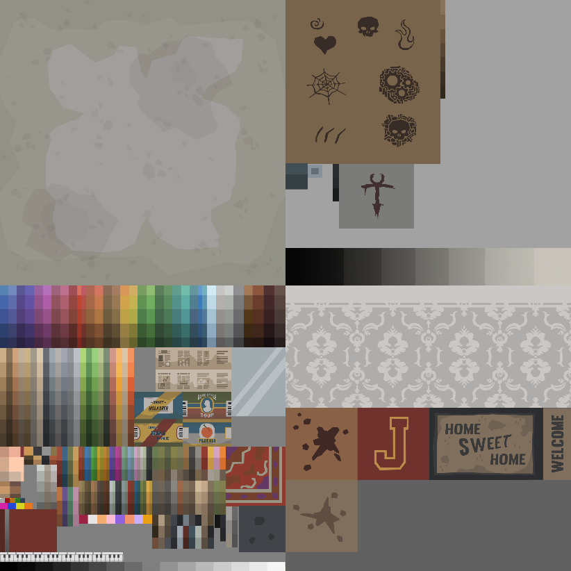
  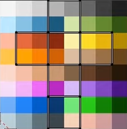
  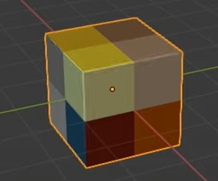

## Assets

### 1. Circuit Breakers

  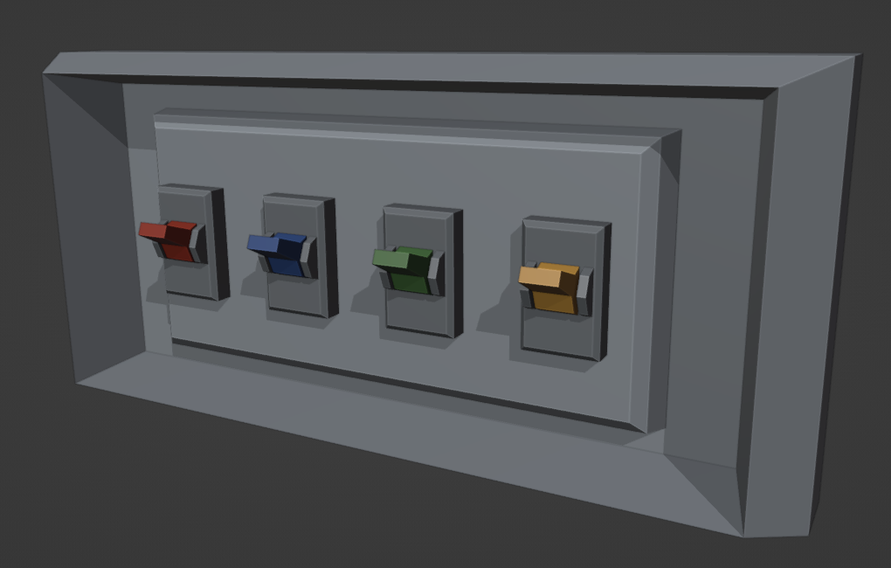

*Circuit breakers: With different colors, players would need to find them as they were exploring the game, followed by a color pattern puzzle.*

---

### 1. Astrolobe

  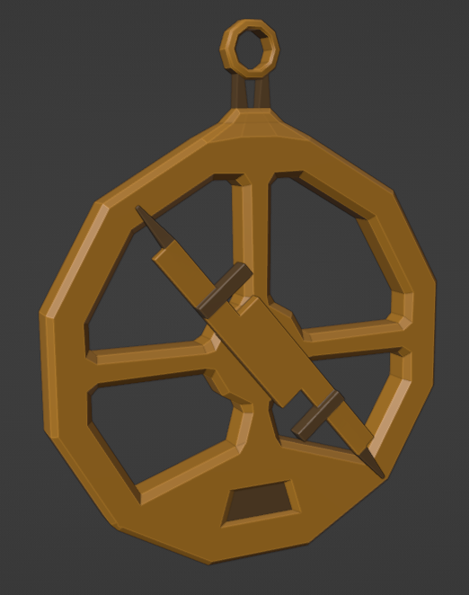

*Astrolobe: Players used it to help guide them, similar to a compass.*

---

### 1. Trapdoor

  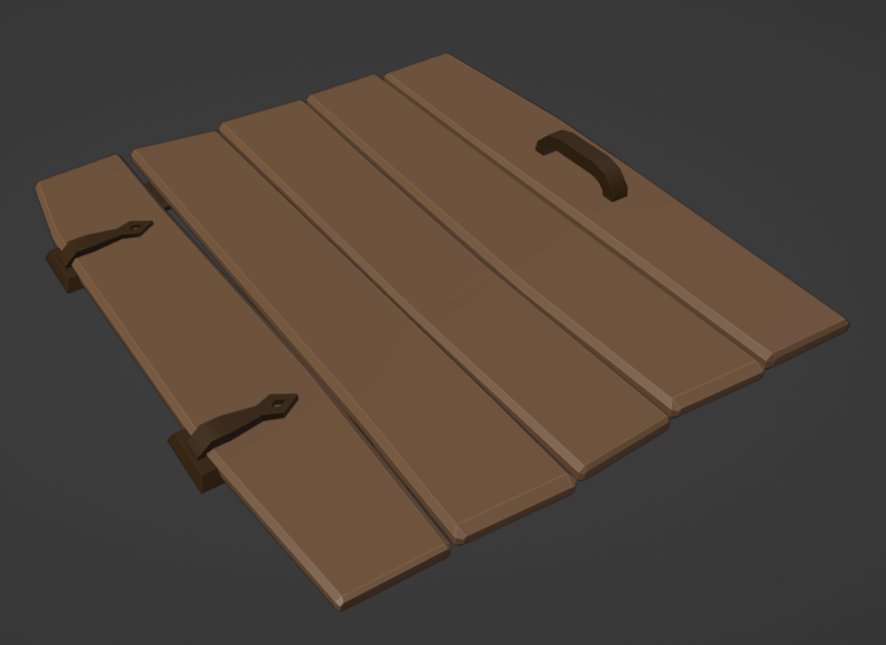
  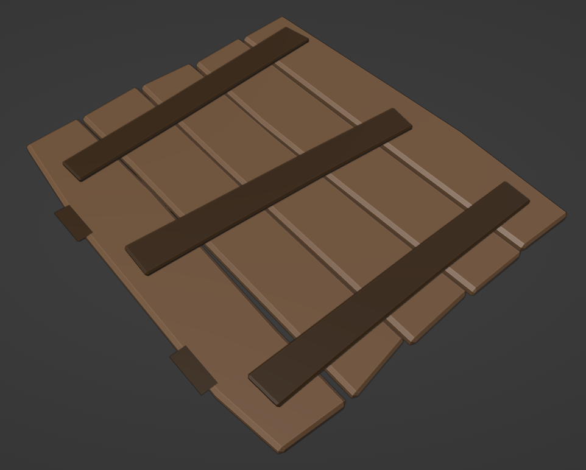

*Trapdoor: Just a trapdoor*

---

### 1. Mouse Trap

  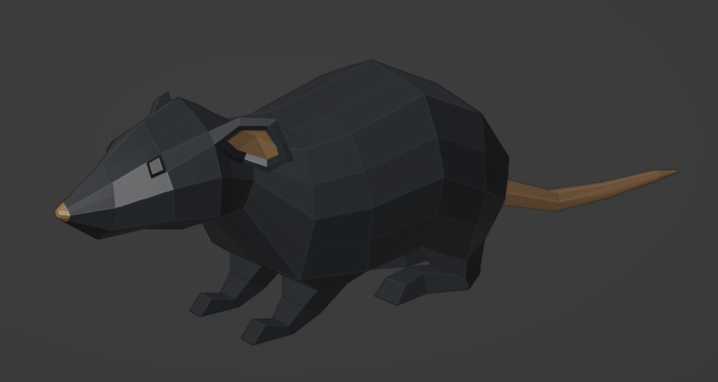
  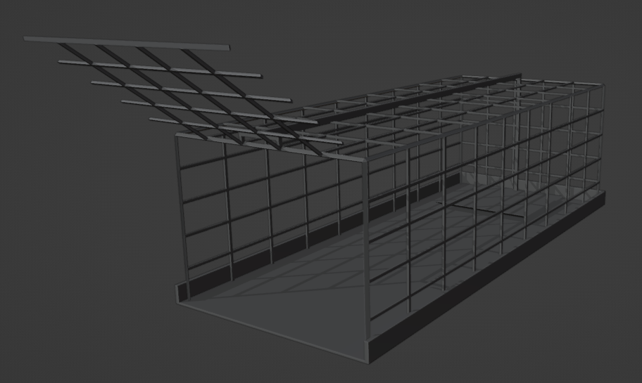
  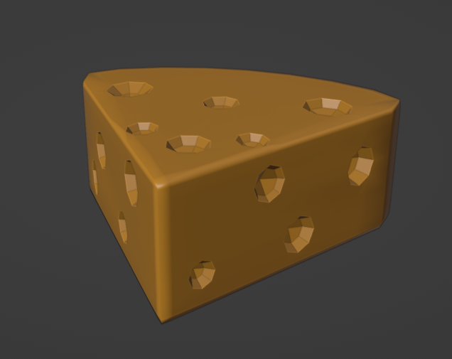

*Mouse trap: After finding the cheese, players would put it in the trap, attracting the mouse to it, stepping on a pressure plate.*

---

### 1. Entry Panel

  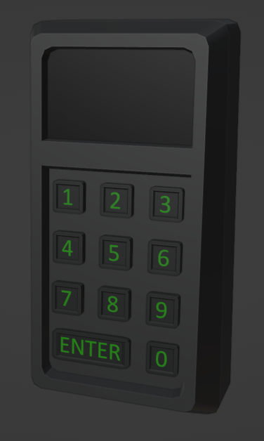

*Entry Panel: Players needed to find clues that would give them the correct PIN.*

---

### 1. Statue Puzzle

  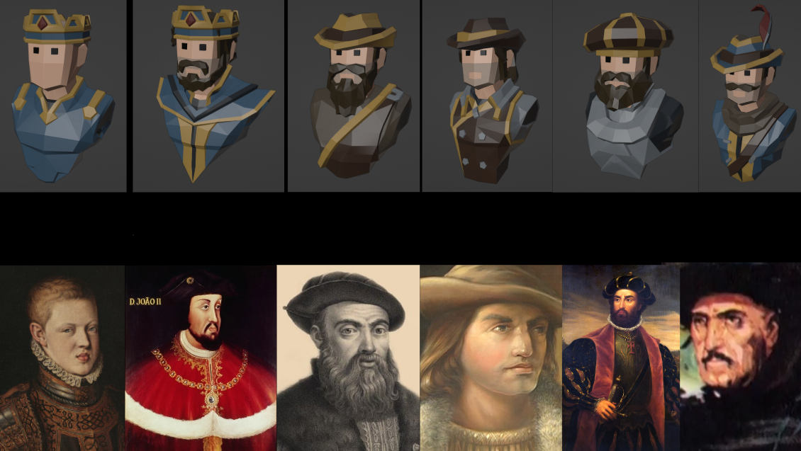

*Statue Puzzle: Given different clues and riddles, players would need to put each statue in their respective podium. These are statues of Portuguese kings and explorers*

---

### 1. Flower

  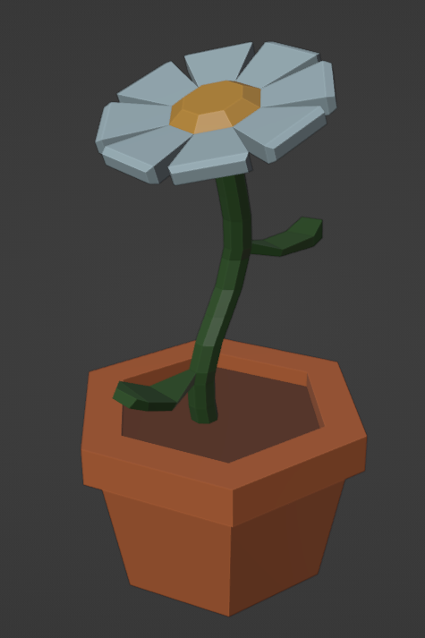

*Flower: Used in a puzzle where players needed to correctly place different objects*

---

### 1. Horse

  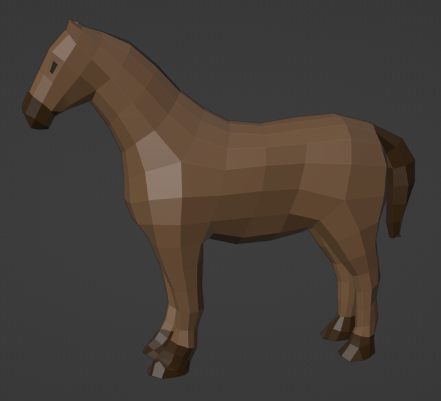

*Horse: Same puzzle as flower.*

---

### 1. Ship

  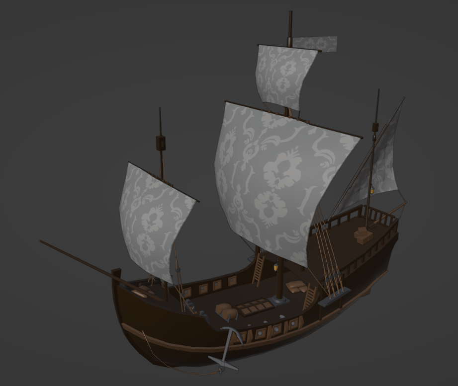
  
  
  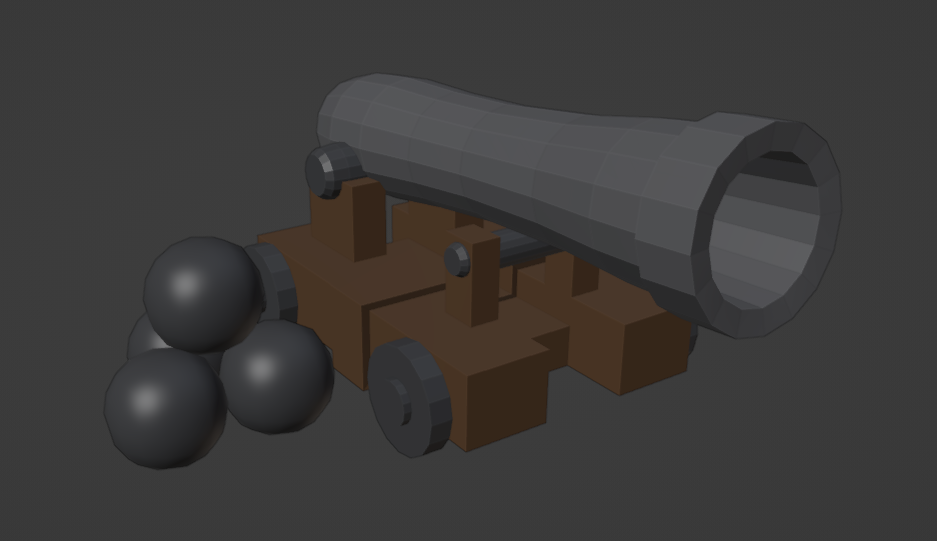
  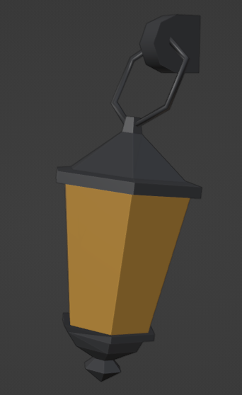

*Ship: Used as a level.*

---
- **Gustavo Barros**
